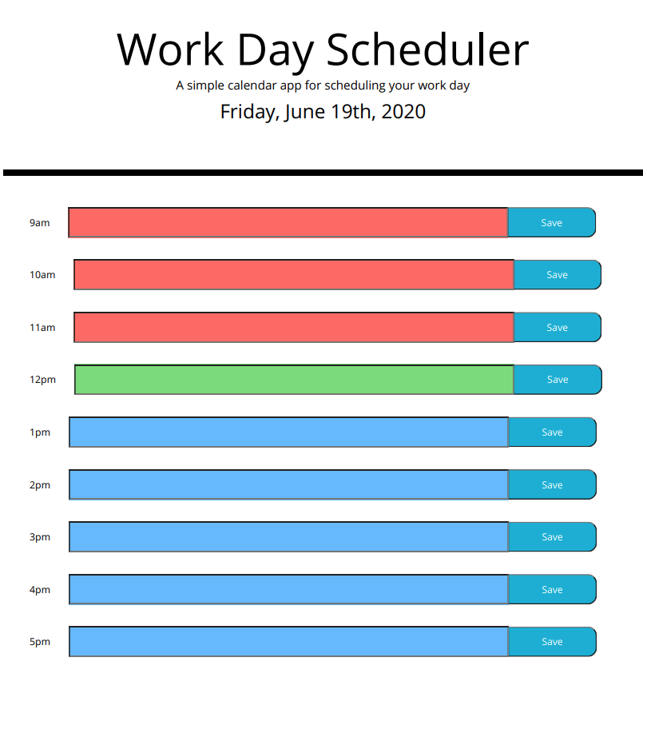

# WorkDayScheduler
This application allows a user to **save their input for each hour of a workday**. The user can iput a text reminder in a given hour and save it so that even after exiting the browser the user is able to see their saved tasks. The planner uses **color** to signify the past hours, the present hour, and the futures hours that a user has in their workday. This application utilizes the **moment.js API** to display the correct date and know what hours are past, present, and future.

# Deployed Application
https://mackenzieraeclark.github.io/WorkDayScheduler/ - automatic!

# App Appearance

